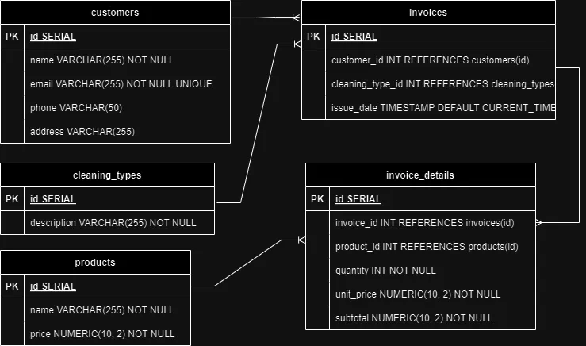

# ServiAseo Invoice Management System

## Descripción

El sistema de gestión de facturas de **ServiAseo** es una aplicación basada en Spring Boot que permite crear, almacenar y enviar facturas por correo electrónico (simulado) a los clientes. La aplicación está integrada con una base de datos PostgreSQL para la persistencia de datos.

## Requisitos Previos

Antes de poder ejecutar este proyecto, asegúrate de tener instalados los siguientes componentes:

- **Java Development Kit (JDK)** 17 o superior
- **Maven** 3.6.0 o superior
- **PostgreSQL** 13 o superior

# Descripción del Modelo Entidad-Relación

## 1. El modelo entidad-relación (ER) para la aplicación de gestión de servicios de limpieza se basa en las siguientes tablas:

## 1.1. Tabla `customers`
- **Descripción:** Almacena la información de los clientes.
- **Campos:**
  - `id`: Identificador único del cliente (Primary Key).
  - `name`: Nombre del cliente (No puede ser nulo).
  - `email`: Correo electrónico del cliente (Debe ser único y no puede ser nulo).
  - `phone`: Número de teléfono del cliente.
  - `address`: Dirección del cliente.

## 1.2. Tabla `cleaning_types`
- **Descripción:** Contiene los diferentes tipos de servicios de limpieza que se ofrecen.
- **Campos:**
  - `id`: Identificador único del tipo de limpieza (Primary Key).
  - `name`: Nombre del tipo de limpieza (No puede ser nulo).

## 1.3. Tabla `invoices`
- **Descripción:** Registra las facturas emitidas a los clientes.
- **Campos:**
  - `id`: Identificador único de la factura (Primary Key).
  - `issue_date`: Fecha de emisión de la factura (No puede ser nulo).
  - `cleaning_type_id`: Referencia al tipo de limpieza asociado (Foreign Key que referencia a `cleaning_types(id)`).
  - `customer_id`: Referencia al cliente asociado (Foreign Key que referencia a `customers(id)`).
  - `amount`: Monto total de la factura (No puede ser nulo).

## 1.4. Tabla `invoice_details`
- **Descripción:** Detalles específicos de cada factura, como los servicios o productos facturados.
- **Campos:**
  - `id`: Identificador único del detalle de la factura (Primary Key).
  - `invoice_id`: Referencia a la factura asociada (Foreign Key que referencia a `invoices(id)`).
  - `description`: Descripción del servicio o producto facturado (No puede ser nulo).
  - `quantity`: Cantidad del servicio o producto facturado (No puede ser nulo).
  - `price`: Precio del servicio o producto facturado (No puede ser nulo).

## 1.5. Tabla `products`
- **Descripción:** Contiene la información de los productos que pueden ser incluidos en las facturas.
- **Campos:**
  - `id`: Identificador único del producto (Primary Key).
  - `name`: Nombre del producto (No puede ser nulo).
  - `price`: Precio del producto (No puede ser nulo).

## 1.6. Tabla `email_logs`
- **Descripción:** Registra los correos electrónicos enviados, incluyendo los detalles del correo.
- **Campos:**
  - `id`: Identificador único del registro del correo (Primary Key).
  - `recipient`: Correo electrónico del destinatario (No puede ser nulo).
  - `subject`: Asunto del correo electrónico (No puede ser nulo).
  - `body`: Cuerpo del mensaje del correo electrónico (No puede ser nulo).
  - `attachment_size`: Tamaño del archivo adjunto (opcional).
  - `timestamp`: Marca de tiempo cuando se envió el correo (No puede ser nulo).

## 1.7. Relaciones Entre Tablas

- **customers 1:N invoices:** Un cliente puede tener múltiples facturas asociadas.
- **invoices N:1 cleaning_types:** Cada factura está asociada con un tipo de limpieza específico.
- **invoices 1:N invoice_details:** Cada factura puede tener múltiples detalles de factura asociados.
- **invoice_details N:1 invoices:** Cada detalle de factura está asociado con una factura específica.
- **email_logs:** Esta tabla no tiene relaciones directas con otras tablas, ya que simplemente registra los correos enviados.

## 1.8. Diagrama ER




## 2. Configuración de la Base de Datos

### 2.1 Crear la Base de Datos

Primero, necesitas crear la base de datos en PostgreSQL.

1. Conéctate a tu servidor PostgreSQL usando `psql` o `pgAdmin`.
2. Crea la base de datos:

   ```sql
   CREATE DATABASE serviaseo_db;


## 2.2 Crear las Tablas

A continuación, crea las tablas necesarias para el proyecto.

### 2.2.1 Tabla `customers`

```sql
CREATE TABLE customers (
    id SERIAL PRIMARY KEY,
    name VARCHAR(255) NOT NULL,
    email VARCHAR(255) UNIQUE NOT NULL,
    phone VARCHAR(20),
    address VARCHAR(255)
);
```
### 2.2.2 Tabla `cleaning_types`

```sql
CREATE TABLE cleaning_types (
    id SERIAL PRIMARY KEY,
    name VARCHAR(255) NOT NULL
);
```
### 2.2.3 Tabla `invoices`

```sql
CREATE TABLE invoices (
    id SERIAL PRIMARY KEY,
    issue_date DATE NOT NULL,
    cleaning_type_id INT REFERENCES cleaning_types(id),
    customer_id INT REFERENCES customers(id),
    amount DECIMAL(10, 2) NOT NULL
);
```
### 2.2.4 Tabla `invoice_details`

```sql
CREATE TABLE invoice_details (
    id SERIAL PRIMARY KEY,
    invoice_id INT REFERENCES invoices(id),
    description TEXT NOT NULL,
    quantity INT NOT NULL,
    price DECIMAL(10, 2) NOT NULL
);
```
### 2.2.5 Tabla `products`

```sql
CREATE TABLE products (
    id SERIAL PRIMARY KEY,
    name VARCHAR(255) NOT NULL,
    price DECIMAL(10, 2) NOT NULL
);
```
### 2.2.6 Tabla `email_logs`

```sql
CREATE TABLE email_logs (
    id SERIAL PRIMARY KEY,
    recipient VARCHAR(255) NOT NULL,
    subject VARCHAR(255) NOT NULL,
    body TEXT NOT NULL,
    attachment_size INT,
    timestamp TIMESTAMP NOT NULL
);
```

